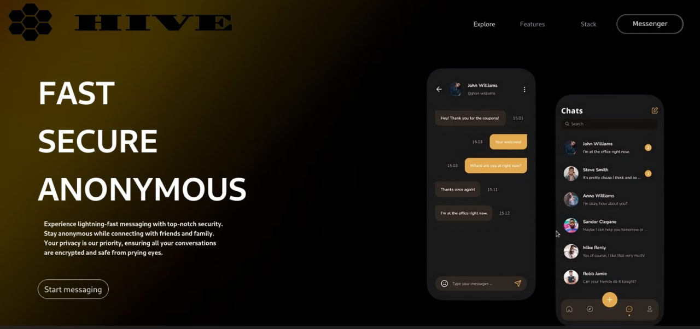
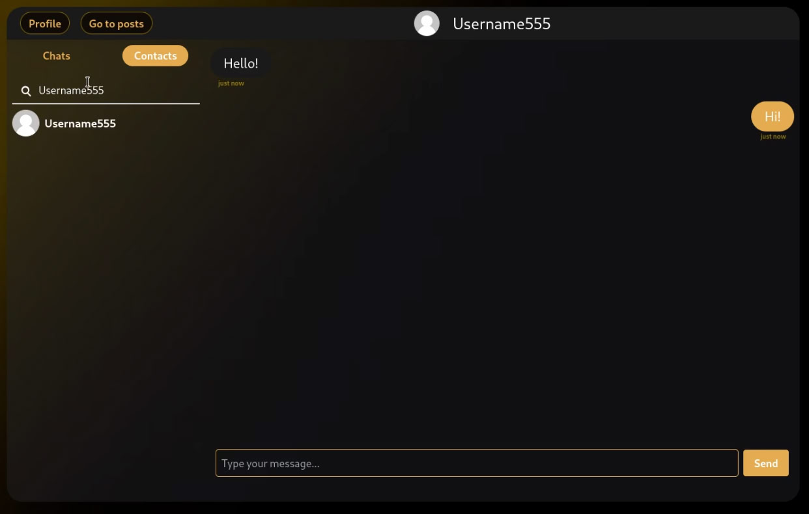
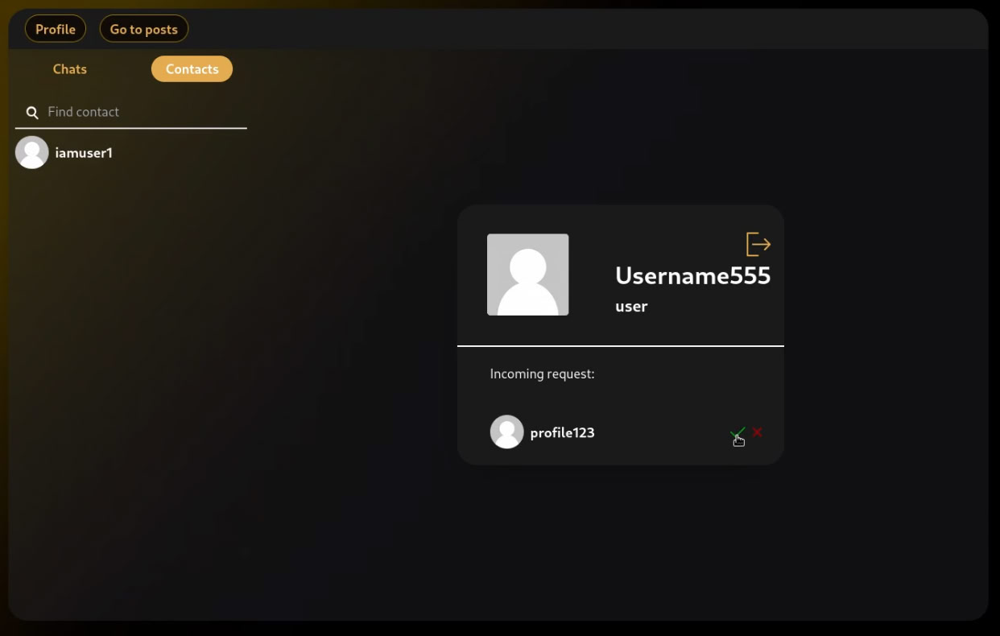
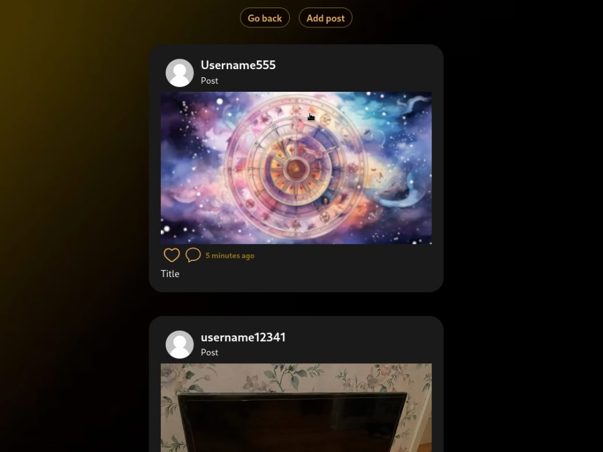
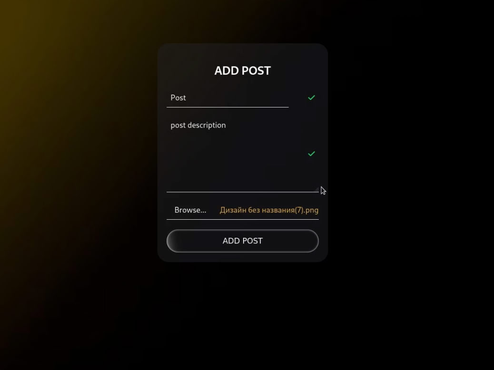

# Hive Frontend
My first full-stack app

This repository is a frontend part of "Hive" project (Spring boot + React + PostgreSQL). It is a messenger app, that supports authentication, JWT security, message exchange as well as posts sharing. This is my first full-stack app, made back in Spring of 2024 to try out Spring boot and React skills. Even though, the code is weak, the foundation of it will serve for my current big commercial project.

## Features
- Sign up/Sign in
- Send friend request
- Receive, accept/deny request
- Send message in a chat
- Post photos
- View posts
- Real-time messaging with WebSockets

## Design

